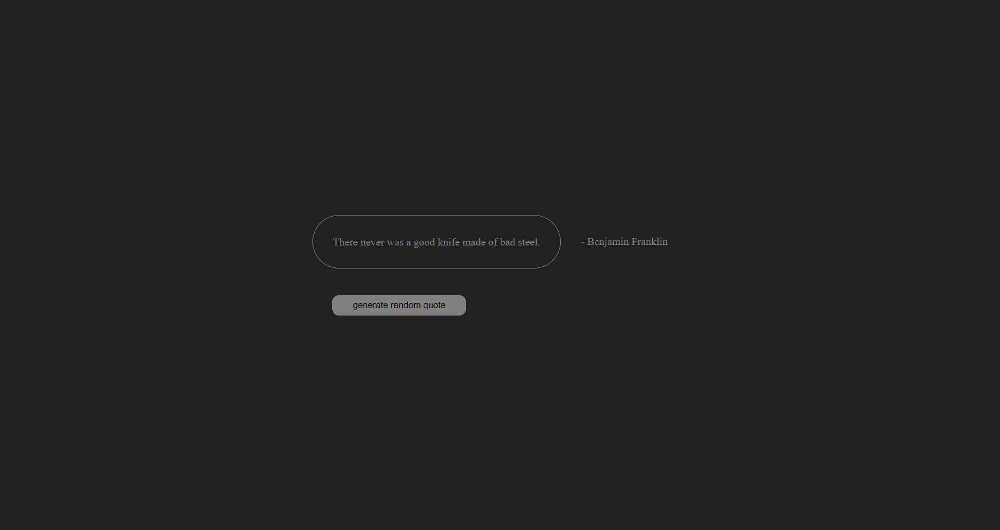

# Quote Generator

## Description
### Users should be able to:
- Read a random quote upon entering the site.
- Generate a new random quote when clicking the respective button.

## Live Site
Check out the project live here: [Quote Generator](https://random-quotes-ruby.vercel.app/)

## How to Run Locally
### Prerequisites
- Node.js and npm installed on your system.

### Steps
1. Clone this repository:  
   ```bash
   git clone https://github.com/pl1an/random-quotes.git
   ```
2. Navigate into the project folder:  
   ```bash
   cd random-quotes
   ```
3. Install dependencies:  
   ```bash
   npm install
   ```
4. Start the development server:  
   ```bash
   npm run dev
   ```
5. Open your browser and go to the link in your terminal.

## Versions
### Screenshots
- v1: 


### Future updates:
- Add a tag choice for generated quotes.
- Batch quote generation.

## Skills
- HTML
- CSS ( alinhamento, posicionamento, disposição )
- React : startar , JSX , useState e useEffect.

## Credits and authors
- Author: [pl1an](https://github.com/pl1an)
- API: [quotable](https://github.com/lukePeavey/quotable)
